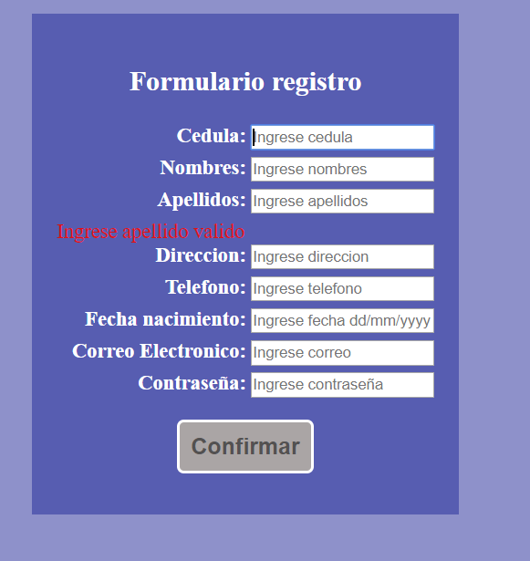

Practica03-Javascrip
====================

| **RESULTADO(S) OBTENIDO(S)**:                                                                                                                                                                    |
|--------------------------------------------------------------------------------------------------------------------------------------------------------------------------------------------------|
| Diseñar una interfaz en HTML que permita ingresar los siguientes campos en un formulario: cedula, nombres, apellidos, dirección, teléfono, fecha de nacimiento, correo electrónico y contraseña. |

| Luego, usando funciones de JavaScript se pide validar que todos los campos han sido ingresados, además; que los valores ingresados en cada campo del formulario sean correctos teniendo en cuenta las siguientes condiciones: |
|-------------------------------------------------------------------------------------------------------------------------------------------------------------------------------------------------------------------------------|
| Se debe validar qué, en el campo del nombres, ingrese mínimo un nombre y que permita ingresar sólo letras.                                                                                                                    |

-   Se debe validar qué, en el campo de la cedula, se ingrese sólo números y que
    la misma sea correcta, en base, al último dígito verificador.

| Se debe validar qué, en el campo del apellidos, ingrese mínimo un apellido y que permita ingresar sólo letras.                                                                                                                                      |
|-----------------------------------------------------------------------------------------------------------------------------------------------------------------------------------------------------------------------------------------------------|
| Se debe validar qué, en el campo del teléfono, permita ingresar sólo números y un máximo de 10.                                                                                                                                                     |
| Se debe validar que la fecha de nacimiento ingrese en el formato dd/mm/yyyy.                                                                                                                                                                        |
| Se debe validar qué, en el campo correo electrónico, permita ingresar un correo válido. Se considera un correo válido, cuando comienza por tres o más valores alfanuméricos, luego un \@, seguido por la extensión “ups.edu.ec” o “est.ups.edu.ec”. |
| Se debe validar que la contraseña ingresada tenga mínimo 8 caracteres, además, debe incluir al menos: una letra mayúscula, una letra minúscula y un carácter especial (\@, \_, \$)                                                                  |

1.  Diseñar una interfaz en html que tenga tres botones que diga “Anterior”,
    “Iniciar”, “Siguiente”, y una imagen. Luego, desde javascript se debe
    controlar para al hacer clic sobre uno de los botones realice una acción
    relacionada a una galería de imágenes

    

    

    

    -   Usuario y Url de la practica:

        Usuario: HugoDavid64

        Url: https://github.com/HugoDavid64/Practica03-Javascrip.git

| **CONCLUSIONES**: JavaScript es una herramienta importante al momento de desarrollar una página web. Nos permite ofrecer una mayor cantidad de funcionalidades al usuario, además de asegurar que el usuario interactúe de forma correcta con la página. La experiencia de usuario es un campo importante dentro del desarrollo web, y JavaScript nos permite mejorarla por medio de animaciones o validaciones que, incluso, permitan personalizar nuestra página para cada usuario. |   |   |   |   |   |   |   |   |   |   |   |   |   |   |   |   |   |   |   |   |   |   |   |   |   |   |   |   |   |   |   |   |
|---------------------------------------------------------------------------------------------------------------------------------------------------------------------------------------------------------------------------------------------------------------------------------------------------------------------------------------------------------------------------------------------------------------------------------------------------------------------------------------|---|---|---|---|---|---|---|---|---|---|---|---|---|---|---|---|---|---|---|---|---|---|---|---|---|---|---|---|---|---|---|---|
| **RECOMENDACIONES**: Gracias JavaScript se han logrado implementar funciones dentro de las páginas HTML, ofreciendo una mayor variedad de opciones al usuario y mejorando su experiencia dentro de la misma, ya que mediante funciones podemos agregar animación a nuestra página. Hemos logrado, además, aumentar la seguridad de la información mediante la validación de datos, asegurándonos que el usuario llene todos los campos de manera correcta.                            |   |   |   |   |   |   |   |   |   |   |   |   |   |   |   |   |   |   |   |   |   |   |   |   |   |   |   |   |   |   |   |   |
